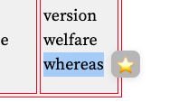
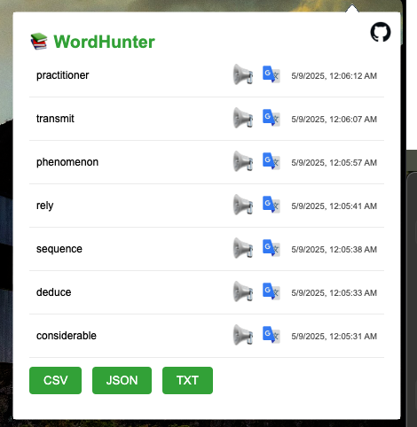

# WordHunter Extension

📚 **WordHunter** is a browser extension designed to help users manage and export word lists in various formats (CSV, JSON, TXT). It provides a simple and intuitive interface for word management.

## Features

- Display a list of words.
- Export word lists in **CSV**, **JSON**, and **TXT** formats.

## Installation

1. Clone the repository:
   ```bash
   git clone https://github.com/ahmetozkanio/WordHunterExtension.git
   ```
2. Open your browser and navigate to the extensions page:
   - **Chrome**: `chrome://extensions/`
   - **Edge**: `edge://extensions/`
3. Enable **Developer Mode**.
4. Click on **Load unpacked** and select the project folder.

## Usage

1. Open the extension popup by clicking on the WordHunter icon in your browser toolbar.
2. View the list of words.
3. Export the word list by clicking on the desired format button (CSV, JSON, TXT).

## Screenshots

### Word Selection


### Popup Interface


## Contributing

Contributions are welcome! Please follow these steps:

1. Fork the repository.
2. Create a new branch:
   ```bash
   git checkout -b feature-name
   ```
3. Make your changes and commit them:
   ```bash
   git commit -m "Add feature-name"
   ```
4. Push to your forked repository:
   ```bash
   git push origin feature-name
   ```
5. Open a pull request.