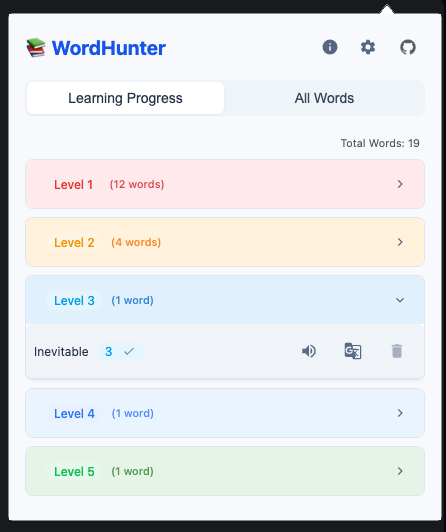

# WordHunter Extension

📚 **WordHunter** is a powerful browser extension that combines word collection and spaced repetition learning techniques to help you master new vocabulary effectively. Whether you're learning a new language or expanding your vocabulary, WordHunter provides a seamless experience for collecting words from any website and learning them through scientifically proven spaced repetition intervals.

## Core Features

- **Smart Word Collection**: Easily collect words from any website while browsing
- **Spaced Repetition System**: Scientifically optimized review intervals for maximum retention
- **Learning Progress Tracking**: 7-level learning system with automatic review scheduling
- **Flexible Import/Export**: Support for CSV, JSON, and TXT formats
- **Interactive Learning Tools**: 
  - Text-to-speech pronunciation
  - One-click Google Translate integration
  - Word encounter tracking
  - Progress visualization

## Learning System

WordHunter implements a sophisticated spaced repetition algorithm with 7 progressive learning levels:

- **Level 0**: New words awaiting study
- **Level 1**: Initial learning (Review today)
- **Level 2**: Early retention (Review tomorrow)
- **Level 3**: Basic mastery (Review in 4 days)
- **Level 4**: Intermediate mastery (Review in 7 days)
- **Level 5**: Advanced retention (Review in 14 days)
- **Level 6**: Complete mastery (Review in 30 days)

The system automatically adjusts review intervals based on your performance, ensuring optimal learning efficiency. If you fail to recall a word during its scheduled review, the system will automatically decrease its level, requiring more frequent reviews until mastery is achieved. This adaptive approach increases the repetition count for challenging words, reinforcing your memory and improving long-term retention.

## Key Benefits

- **Efficient Learning**: Scientific spaced repetition intervals maximize retention
- **Flexible Collection**: Gather words from any website or add them manually
- **Progress Tracking**: Visual indicators of learning progress
- **Smart Notifications**: Timely reminders for scheduled reviews
- **Data Portability**: Easy import/export of your word collection
- **User-Friendly Interface**: Intuitive design for seamless learning experience
- **Adaptive Learning**: Automatic level adjustment based on review performance

## Installation

1. Clone the repository:
   ```bash
   git clone https://github.com/ahmetozkanio/WordHunterExtension.git
   ```
2. Open your browser and navigate to the extensions page:
   - **Chrome**: `chrome://extensions/`
   - **Edge**: `edge://extensions/`
   - **Opera**: `opera://extensions/`

3. Enable **Developer Mode**.
4. Click on **Load unpacked** and select the project folder.

## Usage

1. **Word Collection**:
   - Browse any website and collect words
   - Manually add words to your collection
   - Import existing word lists

2. **Learning Management**:
   - View words in three organized sections:
     - **All Words**: Complete collection
     - **Learning Progress**: Words grouped by level
     - **Spaced Repetition**: Scheduled reviews
   - Track progress with level indicators
   - Receive notifications for daily reviews

3. **Review System**:
   - Follow the spaced repetition schedule
   - Update word levels based on recall
   - Monitor learning progress
   - Automatic level adjustment for missed reviews
   - Progressive learning path with level up/down mechanics
   - Increased repetition for challenging words

## Screenshots

### Word Selection


### Popup Interface


## Contributing

Contributions are welcome! Please follow these steps:

1. Fork the repository.
2. Create a new branch:
   ```bash
   git checkout -b feature-name
   ```
3. Make your changes and commit them:
   ```bash
   git commit -m "Add feature-name"
   ```
4. Push to your forked repository:
   ```bash
   git push origin feature-name
   ```
5. Open a pull request.